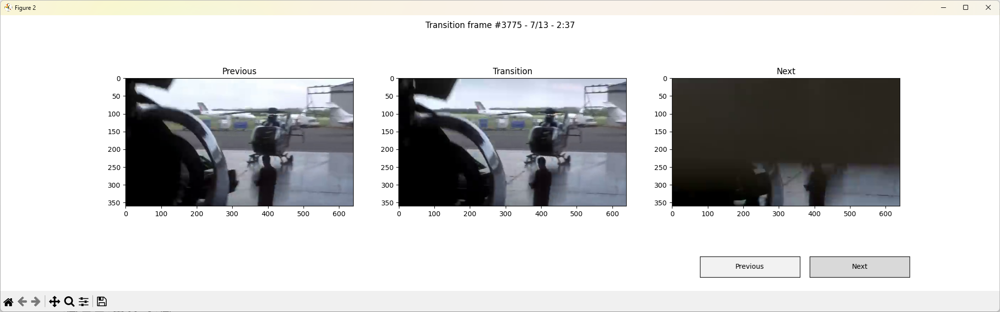

# Shot transition detection

This is a collection of python scripts that perform automatic detection of transitions between shots in a video.

## Inspiration
Detecting shot transitions can be used widely, for example assisting in a video edditing software or even help streaming services to place ads during the transition so the viewer won't click away!

If you are interested in this topic you can check out the following links:

- https://www.researchgate.net/publication/2857629_Comparison_of_Video_Shot_Boundary_Detection_Techniques

- https://github.com/AlphaPav/Video-Shot-Detection

- https://github.com/nick8592/Video-Shot-Detection

## Disclaimer
This is purely an experimental project. I will not be performing extensive evaluation tests. The proposed methods are not advanced in any way. I will be updating this in the future.

## Requirements
Developped and tested with Python 3.13.

Clone repo and create a virtual enviroment:
```
git clone https://github.com/mataktelis11/shot-transition-detection-tests.git
cd shot-transition-detection-tests
python -m venv .env
```

You will also need `ffmpeg`. If you are runnig GNU\Linux you probably have it installed already, otherwise you can get it with you package manager. For other platforms you can download it from [ffmpeg.org](https://www.ffmpeg.org/).

You can now test out all the impletnted methods.

- [Method 1: Comparing color histograms of successive frames](#method-1-comparing-color-histograms-of-successive-frames)
- [Method 2: Frame Differencing and entropy](#method-2-frame-differencing-and-entropy)
- [Method 3: Optical Flow](#method-3-optical-flow)

## Method 1: Comparing color histograms of successive frames

As the title suggests, we simply compute the color histograms of each frame (one for each color channel). We then calculate the cosine distance between the histograms of successive frames.

We now have three distances for each pair of frames. To simplify things we take the average of the three distances and work with it from now on.

The vector containing the average distances can now be analyzed to obtain possible shot transitions. This is done by finding the peaks in the vector. We use scipy's `find_peaks` function with the `prominence` arguement. See more [here](https://docs.scipy.org/doc/scipy-1.15.0/reference/generated/scipy.signal.find_peaks.html). The prominence needs to be adjusted in order to obtain results.

### Usage
Run the script by providing an video file of your choosing:
```
python  hist_cosine_dist_sd.py -f video.mp4
```
You can also provide a value for the `prominence` arguement. Default value is `0.5`
```
python  hist_cosine_dist_sd.py -f video.mp4 -p 0.3
```
Example Results:





Video source: https://www.youtube.com/watch?v=gBcOBWq8J6w

## Method 2: Frame Differencing and entropy
In motion detection and video compretion we often examine the differences between frames. This is called frame differencing and we can use it for transition detection.

By using `ffmpeg` we can generate a video conisting only by the frame differences. This can be called a **motion video**. By examinig the motion video we could obtain infromation about possible transitions.

When a transition occurs there should be plenty of details in the motion video. We can test this concept by calculating the **entropy** of each motion frame. 

Use the following command provided by this article: https://www.arj.no/2022/01/09/frame-differencing-with-ffmpeg

```
ffmpeg -i video.mp4 -filter_complex "format=gbrp,tblend=all_mode=difference" motion_video.mp4
```
This will generate the motion video. Use [vlc](https://www.videolan.org/vlc) if your video player can't open it.

You can now use the python script by providing the original video as well as the motion video:
```
python entropy_frame_diff.py -f video.mp4 -m motion_video.mp4
```
This also uses scipy's `find_peaks` to detect the transitions. You can provide a value for the `prominence` arguement. Default value is `0.5`:
```
python entropy_frame_diff.py -f video.mp4 -m motion_video.mp4 -p 0.3
```

## Method 3: Optical Flow
In this case we perform optical flow in order to detect movement in the video. The OpenCV docs provide a working example of Dense Optical Flow. This can be used to extract the magnitude of the optical flow vectors. By calculating the average magnitude we get an estimation of the motion between two frames. If the motion is too big we can assume it is a video transition.

We approach this by using scipy's `find_peaks` again.

### Usage
Run the script by providing an video file of your choosing:
```
python optical_flow.py -f video.mp4
```
Once again, you can also provide a value for the `prominence` arguement. Default value is `0.5`
```
python optical_flow.py -f video.mp4 -p 0.3
```

# Sources and credits
Note some sources are referenced directly in the code
Will update this list as I add more stuff
- https://docs.opencv.org/3.4/d4/dee/tutorial_optical_flow.html

For the videos used in the screenshots, they are for **obviously of educational purposes - I do not own the copyrights or anything**: